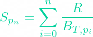
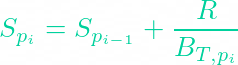

# My approach to the [Exactly Finance challenge](https://github.com/exactly-finance/challenge)

The project is divided into two sections: `Smart Contracts` & `Frontend`.

> The challenge does not explicitly require a frontend, however I've decided to add it anyway as an extra learning experience for myself.

## 🧙‍♂️ Tech used

-   `Smart Contracts`:
    -   Solidity - _Smart Contracts_
    -   ETH-Brownie - _Development Framework_
-   `Frontend`
    -   React - _UI Framework_ (WIP)
    -   Ethers.js - _Web3 Library_ (WIP)

---

## Index

### [🤔 Thought Process - ETHPoolV1](#process1)

-   [The Problem: Efficiency](#the-problem-efficiency)
-   [Proposed Solution](#proposed-solution)
-   [How it works](#how-it-works---v1)
-   [Assumptions](#domain-assumptions)

### [🤔 Thought Process - ETHPoolV2](#process2)

-   [Upgrading the V1 Contract](#upgrading-the-v1-contract)
-   [How it works](#how-it-works---v2)
-   [To keep in mind](#to-keep-in-mind)

### [💻 Set up](#set-up)

### [🖱 Give it a try](#try)

### [📹 Showcase](#showcase)

### [📚 Resources](#resources)

---

## 🤔 Thought Process - ETHPool V1

Below is the thought process I took, and the way I decided to solve the challenge.

### Smart Contracts

As far as the description goes, only one contract is required, which is `ETHPool`.

It should allow:

-   (Public) Deposit _ETH_ staking.
-   (Public) Withdraw staked _ETH_.
-   (Public) Claim accumulated _ETH_ rewards.
-   (Public) Claim&Withdraw combined method.

--

-   (Owner) Deposit _ETH_ rewards.

--

-   (Read) Check user's staked _ETH_ balance.
-   (Read) Check contract's _ETH_ balance.

The reward system must:

-   Only transfer the _ETH_ rewards to the user when they claim it.
-   Reward calculation only takes into account the users in the pool at the time it is deposited by the owner.
-   More?

### The Problem: Efficiency

It is easy and intuitive to come up with a straight-forward solution that's able to distribute the rewards proportionally between all of the pool's participants whenever the rewards are deposited.

However, _in my opinion_, doing this would not be elegant at all, as it would require looping through all users and calculate their share every single time. In general - though specially in a blockchain context - this would make the transaction considerably **expensive** in terms of computational power, and **not scalable** as it would only get worse the more users are involved.

This is why I've opted to look for an alternative to try and solve this in a much more efficient way.

### Proposed Solution

> My approach to solve this problem is heavily inspired by the different [resources](#resources) found at the end of this file. However I had to come up with an adaptation in order to abide by the restrictions presented by this challenge.

There are two main factors to be considered in this problem:

-   Rewards are _sporadic_. There is no fixed interval between rewards. [(Why)](#domain-assumptions)
-   Rewards are not sent to the user until they claim them. This means that the rewards can't just be paid out whenever the deposit happens, but instead the solution needs to keep track of the corresponding rewards each user is entitled to. This is what's considered a **Pull-Based Reward Distribution**.

The way I've chosen to solve this problem consists of the use of **_Masks_**. These are used to represent the accumulated rewards generated by the contract up to a certain _period_ of time. Only two kinds of masks are stored:

-   `totalRewardPerTokenMask`: Only one value. Global.
-   `userRewardPerTokenMask`: Multiple. One per User.

An explanation will come further down, but jumping straight ahead for now, the solution for calculating the rewards of a User _u_ at period _n_ can be seen as:

where:

-   u = User _u_.
-   pn = Period _n_.
-   Bu, pn = Balance of User _u_ at period _n_.
-   _Spn_ = `totalRewardPerTokenMask` at period _n_.
-   _Su, pi_ = Latest `userRewardPerTokenMask` of User _u_.

> In this problem's context, a **_Period_** is considered as passed whenever a new reward deposit is made.
>
> In a more realistic contract, a _Period_ would be some other kind of unit, like Blocks or Time.

Now, what are these _S_ values?

Well, the _S_ value is an accumulator that contains all the reward history of the contract. It takes the rewards _R_ and distributes them between all the staked tokens in the pool at a certain time, _BT, pi_ . That is:

And this is where the magic 🧙‍♂️ happens.

As it can be deduced from the above formula, the _S_ value would require a loop in order to be computed for a certain time of distribution _n_. However, what if we can guarantee that this _n_ value is always the latest period? To make this possible, all calculations in the smart contract are thus done progressively as different **mutative** interactions happen. And to further optimize this process, these interactions can be divided into two types:

-   _User Interaction_:

    Happens when a _user_ interacts with the smart contract in a state-mutative way (`deposit`, `withdraw`, or `claim`)

    When this happens, the user-related reward state variables need to be calculated. That is:

    -   Update user's accumulated rewards, if applicable.
    -   Update user's latest mask to fit the new reward calculation. (_Su_)

-   _Reward Interaction_:

    Happens when the _admin_ interacts with the smart contract in a state-mutative way (`depositReward`)

    When this happens, the global reward state variable is updated:

    -   Update the total mask. (_S_)
        -   This is specific to this domain since the reward depositing action is what signals the change of the current _Period_.
    -   **[!]** Does not do any calculations related to the users.

Thus, the strategy consists of avoiding having to go through the sum process on one go (loop), and instead calculate the next _S_ whenever a new period _pi_ begins, using the corresponding rewards _R_ and the current pool balance _BT, pi_ , and accumulating the result into _Si-1_. That is:

> **[!]** This calculation is performed on every **_Reward Interaction_**

So _S_ contains the total reward per staked token from the very beginning until the current period. In other words, we can use _S_ to know how many rewards each token is worth from the start of the rewards, and thus can calculate the corresponding rewards each user is entitled to by using their balance.

We are still not quite done, though.

Now another thing missing is some way to "tag" the moment from which the user has rights to claim part of those total rewards. This is where _Su_ comes in; a variable that denotes the amount of _S_ rewards that **don't** belong to User _u_. Subtracting it does the job here, as it will take out any previous rewards the pool has produced until the current period, and allow for any upcoming ones to count towards the user's pending rewards.

Last step is to always override User _u_'s latest mask _Su, pi_, whenever their rewards are calculated; with the current total mask: _Su, pi_ = _Su, pn_

--

So, looking back at the full formula:

> **[!]** This calculation is performed on every **_User Interaction_**

We can now see that **all** values are present when calculating rewards and _pn_ is the current period, since they have all been gradually calculated throughout the contract's lifetime, hence making this an _O(1)_ calculation.

 

<h3 align="center"> <i>And this is how reward calculation can be done in an efficient way, avoiding loops and thus reducing gas consumption.</i> 🔥</h3>

 

### How it works - V1

With the theory and formulas in mind, a rough example of the general flow can be seen as the following:

-   The contract begins in a zero-state, and won't allow reward deposits until there's at least one staking user.
-   Whenever there's a mutative interaction, two things may happen:

    -   _User Interaction_: (`deposit`, `withdraw`, or `claim`)

        -   Update user's accumulated rewards, if applicable. (`userPendingRewards`)
        -   Update user's latest mask (`userRewardPerTokenMask`) to be the current total one (`totalRewardPerTokenMask`)

    -   _Reward Interaction_: (`depositReward`)

        -   Update the total mask. (`totalRewardPerTokenMask`)  

        > These calculations are done **BEFORE** the interaction changes their corresponding state variables. _For example, UserA deposits 100 tokens. When calculating the pending rewards, its balance will be still be 0 because the deposit still has not happened. Later, if UserA deposits another 200, the pending reward calculation will be done with a 100 token balance. And so on..._

-   When a user does a `deposit`, add to its balance, and update the totalPoolBalance accordingly.

-   When a user does a `withdraw`, subtract from its balance, update the totalPoolBalance accordingly and send the corresponding eth.

-   When a user does a `claim`, subtract from its pending rewards and send them to the user. _(In this implementation, a user may not have any staked tokens and still have pending rewards left to claimed.)_

> ### Domain Assumptions
>
> -   **Token ETH**: It appears to me like the only token being considered is the network token, in this case ETH. So I'm building all functionality using this token, that is, both user staking and the reward system will be in ETH. **[Update: This changes in the V2 implementation]**
> -   **Sporadic Rewards**: I'm assuming the "weekly" rewards mentioned in the challenge's description were just an example. My understanding is that there wouldn't be an actual **fixed** interval if the rewards are handled manually by the contract's admin. Thus this leads me to believe the reward deposits themselves can happen at any desired time.
>     -   A much more realistic staking contract would likely implement their rewards with a fix rate per block, or time; Implementing these are far easier with the method I use, though I was able to adapt it successfully.
> -   **Dynamic Reward Amount**: The amount of rewards to be distributed when a deposit happens can be any amount with no restrictions.
> -   **The Owner is the Admin**: For simplicity, the admin in charge of the rewards is the owner itself.
>     -   This could easily be extended to allow more than one people, aka, create a _Team_ role instead.

## 🤔 Thought Process - ETHPool V2

TODO :)

### Upgrading the V1 Contract

### How it works - V2

### To keep in mind

## 💻 Set up

TODO :)

## 🖱 Give it a try

TODO :)

## 📹 Showcase

TODO :)

## 📚 Resources

> ### Smart Contract Solution
>
> -   Paper _"Scalable Reward Distribution on the Ethereum Blockchain"_ by Bogdan Batog, Lucian Boca, Nick Johnson.
>
> -   EIP-1973 [Scalable Rewards](https://eips.ethereum.org/EIPS/eip-1973).
>
> -   Scalable implementation of the [Synthetix Reward System](https://github.com/Synthetixio/synthetix/blob/develop/contracts/StakingRewards.sol), despite not being completely applicable to this challenge's requirements.
>
> -   [Scalable Reward Distribution with Changing Stake Sizes](https://solmaz.io/2019/02/24/scalable-reward-changing/), Solmaz.io.

> ### Smart Contract Testing
>
> -   Inspiration about different [automated tests](https://antonioshadji.github.io/ethereum-staking-smart-contract/#how-to-test-the-stakepool) suitable for a staking pool.
> -   Sorted through the multiple [Synthetix.io Tests](https://github.com/Synthetixio/synthetix/tree/develop/test/contracts), though specially had a close look at the [Staking Rewards](https://github.com/Synthetixio/synthetix/blob/develop/test/contracts/StakingRewards.js) and [Rewards Distribution](https://github.com/Synthetixio/synthetix/blob/develop/test/contracts/RewardsDistribution.js).
